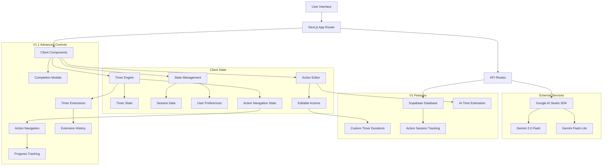
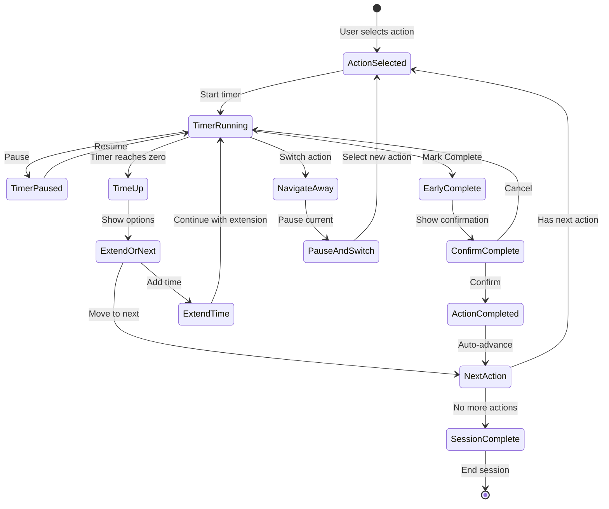

# Design Document

## Overview

Firefly is architected as a lightweight, client-side focused Next.js application optimized for ADHD users who need immediate task initiation without cognitive overhead. The design prioritizes minimal latency, distraction-free interfaces, and progressive enhancement to ensure core functionality works even when AI services are unavailable.

The application follows a simple request-response pattern with server-side AI integration, client-side timer management, and session-based data storage to maintain privacy while providing immediate feedback and guidance.

## Architecture

### Technology Stack
- **Frontend Framework**: Next.js 14+ with App Router
- **Runtime**: Bun (development) with npm fallback for CI/production
- **Styling**: Tailwind CSS for rapid, consistent styling
- **AI Integration**: Google AI Studio SDK (@google/genai) (Gemini Flash with Flash-Lite fallback)
- **Authentication**: Supabase Auth with Google OAuth provider (optional)
- **State Management**: React hooks and context for timer and session state
- **Database**: Supabase (tasks, suggestions, sessions persisted with RLS)

### System Architecture



### Advanced Timer Control Flow



### Request Flow
1. User submits goal → API route → Google AI Studio SDK → Response streams back
2. Timer operations handled entirely client-side for <1s responsiveness
3. Session data stored in Supabase with user authentication
4. **V1 Enhancement Flow**:
   - User edits next actions → Client state updates immediately
   - User clicks "Update with AI" → `/api/ai/estimate` → Time estimates returned
   - User selects action → Timer starts with estimated duration
   - Session progress synced to dashboard in real-time

## Components and Interfaces

### Core Components

#### 1. Enhanced Landing Page (`/`)
- **HeroSection Component**: Compelling tagline and value proposition display
- **FeatureShowcase Component**: Visual feature highlights with ADHD-specific benefits
- **DemoPreview Component**: Screenshots or quick demo of timer interface
- **CallToAction Component**: Prominent "Try Firefly Now" button with smooth transition
- **TaskInput Component**: Centered input field with submit handling (embedded in CTA flow)
- **AIResponse Component**: Displays first step and next actions
- **EditableNextActions Component** (New V1): Inline editing, deletion, and AI re-estimation of next actions
- **TimerLauncher Component**: Preset selection and immediate start capability

#### 2. Timer Interface (`/focus`)
- **VisualTimer Component**: Shrinking disc with mm:ss display
- **TimerControls Component**: Pause/resume/stop functionality
- **ProgressIndicator Component**: Visual progress representation

#### 3. Results Interface (`/complete`)
- **VarianceSummary Component**: Friendly comparison of planned vs actual
- **BufferSuggestion Component**: Optional deadline management tips
- **NextTaskPrompt Component**: Seamless return to task input

#### 4. User Dashboard (`/dashboard`)
- **DashboardStats Component**: Weekly focus time, average session length, completion rate
- **SessionHistory Component**: Last 10 sessions with goals, durations, and variance
- **PersonalRecords Component**: Longest session, best week, streak days highlights
- **ProgressInsights Component**: Encouraging analytics with ADHD-friendly language
- **QuickStart Component**: Prominent "Start New Session" button
- **OnboardingMessage Component**: Encouraging tips for new users with no data

### API Interfaces

#### `/api/ai/suggest`
```typescript
interface SuggestRequest {
  goal: string;
  dueDate?: string;
  urgency?: 'low' | 'medium' | 'high';
}

interface SuggestResponse {
  firstStep: {
    description: string;
    estimatedSeconds: number;
  };
  nextActions: string[];
  bufferRecommendation?: number;
  fallbackUsed?: boolean;
}
```

#### `/api/ai/estimate` (New V1 Feature)
```typescript
interface EstimateRequest {
  actions: string[];
  context?: string;
}

interface EstimateResponse {
  estimatedActions: {
    action: string;
    estimatedMinutes: number;
    confidence: 'low' | 'medium' | 'high';
  }[];
  totalEstimatedTime: number;
}
```

#### `/api/actions/update` (New V1 Feature)
```typescript
interface ActionUpdateRequest {
  sessionId: string;
  actionId: string;
  status: 'completed' | 'skipped' | 'active';
  actualMinutes?: number;
  timeExtensions?: number[];
}

interface ActionUpdateResponse {
  success: boolean;
  updatedAction: EditableAction;
  sessionProgress: {
    completedCount: number;
    totalCount: number;
    nextActionId?: string;
  };
}
```

#### `/api/timer/extend` (New V1 Feature)
```typescript
interface TimerExtendRequest {
  sessionId: string;
  actionId: string;
  extensionMinutes: number;
  reason?: string;
}

interface TimerExtendResponse {
  success: boolean;
  newDuration: number;
  totalExtensions: number;
}
```

#### `/api/auth/session`
```typescript
interface SessionData {
  userId?: string;
  preferences: {
    soundEnabled: boolean;
    defaultDuration: number;
    highContrast: boolean;
  };
}
```

#### `/api/dashboard/stats`
```typescript
interface DashboardStatsRequest {
  userId: string;
  timeframe?: 'week' | 'month' | 'all';
}

interface DashboardStatsResponse {
  totalFocusTime: number; // in minutes
  averageSessionLength: number; // in minutes
  completionRate: number; // percentage
  sessionsThisWeek: number;
  personalRecords: {
    longestSession: number; // in minutes
    bestWeek: number; // total minutes
    currentStreak: number; // days
    longestStreak: number; // days
  };
  recentSessions: TimerSession[];
  insights: {
    message: string;
    type: 'celebration' | 'encouragement' | 'tip';
  }[];
}
```

### State Management Interfaces

#### Timer State (Enhanced)
```typescript
interface TimerState {
  isActive: boolean;
  isPaused: boolean;
  duration: number; // in seconds
  remaining: number;
  startTime: Date;
  plannedDuration: number;
  currentActionId?: string;
  extensions: TimerExtension[];
  canMarkComplete: boolean;
  canNavigate: boolean;
}

interface ActionNavigationState {
  currentIndex: number;
  totalActions: number;
  canGoNext: boolean;
  canGoPrevious: boolean;
  nextActionId?: string;
  previousActionId?: string;
}
```

#### Session State
```typescript
interface SessionState {
  currentGoal: string;
  aiSuggestions: SuggestResponse | null;
  timerHistory: TimerSession[];
  preferences: UserPreferences;
}
```

## Data Models

### Timer Session
```typescript
interface TimerSession {
  id: string;
  goal: string;
  plannedDuration: number; // seconds
  actualDuration: number; // seconds
  completed: boolean;
  startedAt: Date;
  completedAt?: Date;
  variance: number; // percentage difference
}
```

### User Preferences
```typescript
interface UserPreferences {
  defaultTimerDuration: 25 | 45 | 50; // minutes
  soundEnabled: boolean;
  tickSoundEnabled: boolean;
  highContrastMode: boolean;
  reducedMotion: boolean;
  bufferPercentage: number; // default 25%
}
```

### AI Suggestion Cache
```typescript
interface SuggestionCache {
  goal: string;
  response: SuggestResponse;
  timestamp: Date;
  expiresAt: Date; // 1 hour cache
}
```

### Enhanced Next Actions (V1 Feature)
```typescript
interface EditableAction {
  id: string;
  text: string;
  estimatedMinutes?: number;
  confidence?: 'low' | 'medium' | 'high';
  isCustom: boolean; // true if user-modified
  originalText?: string; // for tracking changes
  status: 'pending' | 'active' | 'completed' | 'skipped';
  actualMinutes?: number;
  timeExtensions?: number[]; // array of added minutes
  completedAt?: Date;
  skippedAt?: Date;
}

interface ActionSession {
  sessionId: string;
  goal: string;
  actions: EditableAction[];
  currentActionIndex: number;
  totalEstimatedTime: number;
  actualTimeSpent: number;
  completedCount: number;
  skippedCount: number;
  createdAt: Date;
  updatedAt: Date;
}

interface TimerExtension {
  actionId: string;
  originalDuration: number;
  extensionMinutes: number;
  reason?: string;
  timestamp: Date;
}
```

### Dashboard Analytics
```typescript
interface UserAnalytics {
  userId: string;
  totalSessions: number;
  totalFocusTime: number; // in minutes
  averageSessionLength: number;
  completionRate: number;
  longestSession: number;
  currentStreak: number;
  longestStreak: number;
  lastActiveDate: Date;
  weeklyStats: {
    week: string; // ISO week format
    totalTime: number;
    sessionCount: number;
  }[];
}
```

## Error Handling

### AI Service Failures
- **Primary Strategy**: Graceful degradation with fallback suggestions
- **Fallback Chain**: Gemini Flash → Flash-Lite → Static suggestions
- **User Experience**: Always allow timer start regardless of AI status

### Rate Limiting
- **Detection**: Monitor rate limit responses from Google AI Studio
- **Response**: Automatic fallback to Flash-Lite or cached suggestions
- **User Feedback**: Subtle notification without blocking workflow

### Network Issues
- **Offline Mode**: Timer functionality works without network
- **Progressive Enhancement**: Core features available without AI
- **Retry Logic**: Exponential backoff for API calls

### Timer Accuracy
- **Browser Tab Visibility**: Handle background tab timer drift
- **System Sleep**: Detect and adjust for system sleep/wake
- **Precision**: Use performance.now() for sub-second accuracy

## Testing Strategy

### Testing Strategy (Lean MVP)
- **Manual QA**: Complete user journey testing from goal input to session completion
- **Unit Testing**: Core utility functions (variance calculations, time formatting)
- **Accessibility**: Manual keyboard navigation and screen reader validation
- **Performance**: Manual validation of <1s timer start requirement

## V1 Feature: Enhanced Next Actions Management

### Component Design

#### EditableNextActions Component
- **Inline Editing**: Click-to-edit functionality for each action
- **Delete Actions**: Remove button with confirmation for each action
- **Add Actions**: Allow users to add custom actions to the list
- **AI Re-estimation**: "Update with AI" button to get time estimates
- **Visual Feedback**: Loading states during AI estimation calls

#### ActionTimer Component
- **Custom Durations**: Use AI-estimated time as timer duration
- **Action Context**: Display current action being worked on
- **Progress Tracking**: Mark actions as complete during timer sessions
- **Advanced Controls**: Mark complete early, add time extensions, navigate between actions
- **Action Navigation**: Previous/Next buttons with state preservation
- **Completion Handling**: Smart prompts when timer ends or action completes early

#### TimerControls Component (Enhanced)
- **Mark Complete Button**: Early completion with confirmation
- **Time Extension**: Quick add time options (5, 10, 15 min) and custom input
- **Action Navigation**: Previous/Next action buttons with progress preservation
- **Smart Prompts**: Context-aware suggestions when timer ends or action completes

#### ActionNavigator Component (New)
- **Progress Indicator**: Visual progress bar showing current action position
- **Action Preview**: Display current, previous, and next action titles
- **Navigation Controls**: Previous/Next buttons with disabled states for boundaries
- **Status Indicators**: Visual markers for completed, skipped, and active actions

#### TimerExtensionModal Component (New)
- **Preset Options**: Quick buttons for 5, 10, 15 minute extensions
- **Custom Input**: Text field for custom time amounts
- **Extension History**: Show previous extensions for current action
- **Reason Tracking**: Optional field to note why extension was needed

#### ActionCompletionModal Component (New)
- **Early Completion Confirmation**: Confirm marking action complete before time ends
- **Time Tracking**: Display actual vs estimated time
- **Next Action Preview**: Show what comes next
- **Break Options**: Offer short break before continuing

### Database Schema Extensions

#### action_sessions Table
```sql
CREATE TABLE action_sessions (
  id UUID PRIMARY KEY DEFAULT gen_random_uuid(),
  user_id UUID REFERENCES auth.users(id),
  goal TEXT NOT NULL,
  created_at TIMESTAMP WITH TIME ZONE DEFAULT NOW(),
  updated_at TIMESTAMP WITH TIME ZONE DEFAULT NOW(),
  total_estimated_time INTEGER, -- in minutes
  actual_time_spent INTEGER DEFAULT 0, -- in minutes
  status TEXT DEFAULT 'active' -- 'active', 'completed', 'paused'
);
```

#### editable_actions Table (Enhanced)
```sql
CREATE TABLE editable_actions (
  id UUID PRIMARY KEY DEFAULT gen_random_uuid(),
  session_id UUID REFERENCES action_sessions(id) ON DELETE CASCADE,
  text TEXT NOT NULL,
  estimated_minutes INTEGER,
  actual_minutes INTEGER DEFAULT 0,
  confidence TEXT, -- 'low', 'medium', 'high'
  is_custom BOOLEAN DEFAULT FALSE,
  original_text TEXT,
  order_index INTEGER NOT NULL,
  status TEXT DEFAULT 'pending', -- 'pending', 'active', 'completed', 'skipped'
  completed_at TIMESTAMP WITH TIME ZONE,
  skipped_at TIMESTAMP WITH TIME ZONE,
  created_at TIMESTAMP WITH TIME ZONE DEFAULT NOW(),
  updated_at TIMESTAMP WITH TIME ZONE DEFAULT NOW()
);

-- Add indexes for efficient navigation
CREATE INDEX idx_editable_actions_session_order ON editable_actions(session_id, order_index);
CREATE INDEX idx_editable_actions_status ON editable_actions(status);
```

#### timer_extensions Table (New)
```sql
CREATE TABLE timer_extensions (
  id UUID PRIMARY KEY DEFAULT gen_random_uuid(),
  action_id UUID REFERENCES editable_actions(id) ON DELETE CASCADE,
  session_id UUID REFERENCES action_sessions(id) ON DELETE CASCADE,
  extension_minutes INTEGER NOT NULL,
  reason TEXT,
  created_at TIMESTAMP WITH TIME ZONE DEFAULT NOW()
);

-- RLS policies for timer extensions
ALTER TABLE timer_extensions ENABLE ROW LEVEL SECURITY;
CREATE POLICY "Users can manage their own timer extensions" ON timer_extensions
  FOR ALL USING (
    session_id IN (
      SELECT id FROM action_sessions WHERE user_id = auth.uid()
    )
  );
```

#### action_sessions Table (Enhanced)
```sql
-- Add new columns to existing table
ALTER TABLE action_sessions ADD COLUMN current_action_index INTEGER DEFAULT 0;
ALTER TABLE action_sessions ADD COLUMN completed_count INTEGER DEFAULT 0;
ALTER TABLE action_sessions ADD COLUMN skipped_count INTEGER DEFAULT 0;
ALTER TABLE action_sessions ADD COLUMN total_extensions INTEGER DEFAULT 0;
```

### AI Integration Enhancement

#### Time Estimation Prompt
```
Given these action items: [actions]
For each action, provide a realistic time estimate in minutes for an ADHD user who may need extra time for task switching and focus building.

Consider:
- Task complexity and cognitive load
- Potential for hyperfocus or distraction
- Buffer time for transitions
- ADHD-friendly time estimates (slightly longer than neurotypical estimates)

Return estimates with confidence levels.
```

### Service Layer Architecture

#### ActionNavigationService
```typescript
class ActionNavigationService {
  getCurrentAction(sessionId: string): Promise<EditableAction | null>
  getNextAction(sessionId: string): Promise<EditableAction | null>
  getPreviousAction(sessionId: string): Promise<EditableAction | null>
  switchToAction(sessionId: string, actionId: string): Promise<ActionNavigationState>
  getNavigationState(sessionId: string): Promise<ActionNavigationState>
}
```

#### TimerExtensionService
```typescript
class TimerExtensionService {
  addExtension(actionId: string, minutes: number, reason?: string): Promise<TimerExtension>
  getExtensionHistory(actionId: string): Promise<TimerExtension[]>
  getTotalExtensions(actionId: string): Promise<number>
  calculateNewDuration(actionId: string, extensionMinutes: number): Promise<number>
}
```

#### ActionStatusService
```typescript
class ActionStatusService {
  markComplete(actionId: string, actualMinutes: number): Promise<EditableAction>
  markSkipped(actionId: string): Promise<EditableAction>
  reactivateAction(actionId: string): Promise<EditableAction>
  updateProgress(sessionId: string): Promise<SessionProgress>
  getCompletionStats(sessionId: string): Promise<CompletionStats>
}

interface SessionProgress {
  completedCount: number;
  skippedCount: number;
  totalCount: number;
  currentActionIndex: number;
  percentComplete: number;
}

interface CompletionStats {
  totalActions: number;
  completed: number;
  skipped: number;
  averageAccuracy: number; // estimated vs actual time
  totalTimeSpent: number;
  totalExtensions: number;
}
```

### Error Handling (Enhanced)

#### Timer Control Failures
- **Extension Limits**: Prevent excessive time extensions (max 3 per action)
- **Navigation Boundaries**: Handle first/last action edge cases gracefully
- **State Conflicts**: Resolve conflicts when multiple tabs modify same session
- **Offline Actions**: Queue timer control actions for sync when online

#### Action Status Conflicts
- **Concurrent Updates**: Handle multiple users editing same session (if shared)
- **Invalid Transitions**: Prevent invalid status changes (e.g., skip completed action)
- **Data Integrity**: Ensure action counts match actual statuses
- **Recovery**: Auto-correct inconsistent session state

## Security Considerations

### Data Privacy
- **Supabase RLS**: Row Level Security policies for user data isolation
- **AI Calls**: Strip personal identifiers before sending to Google AI Studio
- **Session Security**: Use secure session tokens for authenticated users
- **Action Data**: User-modified actions stored securely with RLS policies
- **Extension Data**: Timer extensions protected by RLS policies

### API Security
- **Rate Limiting**: Implement per-IP and per-user rate limits
- **Input Validation**: Sanitize all user inputs before AI processing
- **CORS**: Restrict API access to application domain
- **Action Validation**: Validate action text length and content before AI estimation
- **Extension Limits**: Validate extension amounts and prevent abuse

### Authentication Security
- **OAuth Flow**: Secure Google OAuth implementation with Supabase Auth
- **Session Management**: Secure session handling with proper expiration
- **CSRF Protection**: Built-in Next.js CSRF protection for API routes
- **Action Ownership**: Verify user owns session before allowing timer controls