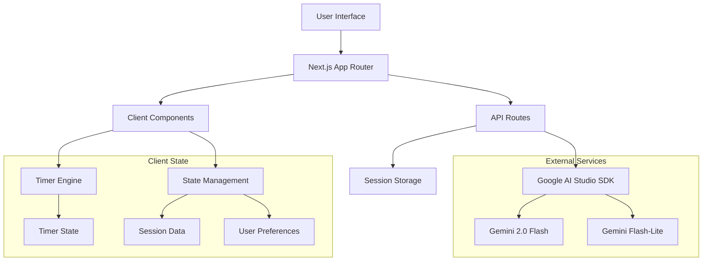

# Design Document

## Overview

Firefly is architected as a lightweight, client-side focused Next.js application optimized for ADHD users who need immediate task initiation without cognitive overhead. The design prioritizes minimal latency, distraction-free interfaces, and progressive enhancement to ensure core functionality works even when AI services are unavailable.

The application follows a simple request-response pattern with server-side AI integration, client-side timer management, and session-based data storage to maintain privacy while providing immediate feedback and guidance.

## Architecture

### Technology Stack
- **Frontend Framework**: Next.js 14+ with App Router
- **Runtime**: Bun (development) with npm fallback for CI/production
- **Styling**: Tailwind CSS for rapid, consistent styling
- **AI Integration**: Google AI Studio SDK (@google/genai) (Gemini Flash with Flash-Lite fallback)
- **Authentication**: Supabase Auth with Google OAuth provider (optional)
- **State Management**: React hooks and context for timer and session state
- **Database**: Supabase (tasks, suggestions, sessions persisted with RLS)

### System Architecture



### Request Flow
1. User submits goal → API route → Google AI Studio SDK → Response streams back
2. Timer operations handled entirely client-side for <1s responsiveness
3. Session data stored in browser storage, cleared on session end

## Components and Interfaces

### Core Components

#### 1. Landing Page (`/`)
- **TaskInput Component**: Centered input field with submit handling
- **AIResponse Component**: Displays first step and next actions
- **TimerLauncher Component**: Preset selection and immediate start capability

#### 2. Timer Interface (`/focus`)
- **VisualTimer Component**: Shrinking disc with mm:ss display
- **TimerControls Component**: Pause/resume/stop functionality
- **ProgressIndicator Component**: Visual progress representation

#### 3. Results Interface (`/complete`)
- **VarianceSummary Component**: Friendly comparison of planned vs actual
- **BufferSuggestion Component**: Optional deadline management tips
- **NextTaskPrompt Component**: Seamless return to task input

### API Interfaces

#### `/api/ai/suggest`
```typescript
interface SuggestRequest {
  goal: string;
  dueDate?: string;
  urgency?: 'low' | 'medium' | 'high';
}

interface SuggestResponse {
  firstStep: {
    description: string;
    estimatedSeconds: number;
  };
  nextActions: string[];
  bufferRecommendation?: number;
  fallbackUsed?: boolean;
}
```

#### `/api/auth/session`
```typescript
interface SessionData {
  userId?: string;
  preferences: {
    soundEnabled: boolean;
    defaultDuration: number;
    highContrast: boolean;
  };
}
```

### State Management Interfaces

#### Timer State
```typescript
interface TimerState {
  isActive: boolean;
  isPaused: boolean;
  duration: number; // in seconds
  remaining: number;
  startTime: Date;
  plannedDuration: number;
}
```

#### Session State
```typescript
interface SessionState {
  currentGoal: string;
  aiSuggestions: SuggestResponse | null;
  timerHistory: TimerSession[];
  preferences: UserPreferences;
}
```

## Data Models

### Timer Session
```typescript
interface TimerSession {
  id: string;
  goal: string;
  plannedDuration: number; // seconds
  actualDuration: number; // seconds
  completed: boolean;
  startedAt: Date;
  completedAt?: Date;
  variance: number; // percentage difference
}
```

### User Preferences
```typescript
interface UserPreferences {
  defaultTimerDuration: 25 | 45 | 50; // minutes
  soundEnabled: boolean;
  tickSoundEnabled: boolean;
  highContrastMode: boolean;
  reducedMotion: boolean;
  bufferPercentage: number; // default 25%
}
```

### AI Suggestion Cache
```typescript
interface SuggestionCache {
  goal: string;
  response: SuggestResponse;
  timestamp: Date;
  expiresAt: Date; // 1 hour cache
}
```

## Error Handling

### AI Service Failures
- **Primary Strategy**: Graceful degradation with fallback suggestions
- **Fallback Chain**: Gemini Flash → Flash-Lite → Static suggestions
- **User Experience**: Always allow timer start regardless of AI status

### Rate Limiting
- **Detection**: Monitor rate limit responses from Google AI Studio
- **Response**: Automatic fallback to Flash-Lite or cached suggestions
- **User Feedback**: Subtle notification without blocking workflow

### Network Issues
- **Offline Mode**: Timer functionality works without network
- **Progressive Enhancement**: Core features available without AI
- **Retry Logic**: Exponential backoff for API calls

### Timer Accuracy
- **Browser Tab Visibility**: Handle background tab timer drift
- **System Sleep**: Detect and adjust for system sleep/wake
- **Precision**: Use performance.now() for sub-second accuracy

## Testing Strategy

### Testing Strategy (Lean MVP)
- **Manual QA**: Complete user journey testing from goal input to session completion
- **Unit Testing**: Core utility functions (variance calculations, time formatting)
- **Accessibility**: Manual keyboard navigation and screen reader validation
- **Performance**: Manual validation of <1s timer start requirement

## Security Considerations

### Data Privacy
- **Supabase RLS**: Row Level Security policies for user data isolation
- **AI Calls**: Strip personal identifiers before sending to Google AI Studio
- **Session Security**: Use secure session tokens for authenticated users

### API Security
- **Rate Limiting**: Implement per-IP and per-user rate limits
- **Input Validation**: Sanitize all user inputs before AI processing
- **CORS**: Restrict API access to application domain

### Authentication Security
- **OAuth Flow**: Secure Google OAuth implementation with Supabase Auth
- **Session Management**: Secure session handling with proper expiration
- **CSRF Protection**: Built-in Next.js CSRF protection for API routes